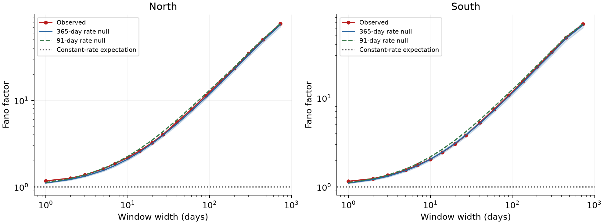

# Week 1 results — The butterfly as a counting process

Source materials: ButterflAI 2.0 commit [0129aea104aec57f5534f9b8472db66f98e54bc7](https://github.com/SwRI-IDEA-Lab/butterflai2/tree/0129aea104aec57f5534f9b8472db66f98e54bc7). The notebook's time coordinate is s, a shift in years from each hemispheric cycle's 15° latitude crossing; it is not scaled by cycle duration.

## Tasks 1–2: latitude model scores

Tasks 1–2 use the peak-area observations in the course's frozen ButterflAI 1.0 latitude model. There are 22,199 events in this scoring set. The model assigns nonzero density to 22,089 events, giving a mean finite negative log-likelihood of **3.2024 nats per event**. It assigns zero density to 110 events (**0.50%**), all between s = −4.78 and −2.87 years. The full-data NLL is therefore **infinite**; the finite mean applies only to events the model could score.

For the 12 one-year windows with at least 50 groups, the latitude Earth Mover's Distance (EMD) has a mean of **0.580°**, median **0.537°**, and range **0.258°–0.890°**. The windows centered at s = −4.5 and 8.5 years were skipped (27 and 8 groups). EMD compares the observed and model-sampled latitude distributions; it does not remove the hard-gate zero-probability events from Task 1.

## Tasks 3–6: emergence events and timing

The selected groups contribute **177,217 daily records**, but the event table contains **22,122 groups**, one first observation per group. Treating each daily record as a separate event would inflate the count about eightfold. A group's first observation may lag its true physical emergence by several days.

The analysis includes cycles **12–23**, both hemispheres, and groups with lifetime peak corrected area strictly greater than **30 MSH**: **11,184 north** and **10,938 south** events across 24 hemispheric cycles. The shifted time values span s = −4.78 to +8.74 years. Cumulative counts rise most steeply around s = 0–2 years. Counts range from **522** (cycle 12 north) to **1,590** (cycle 19 north).

There are **22,098 within-cycle inter-arrival gaps**. Their mean is **4.19 days**, median **2.01 days**, and 90th percentile **9.00 days**. **3,631 (16.4%)** are zero because groups can share an observation timestamp; this catalog resolution does not establish simultaneous physical emergence.

## Tasks 7–9: Fano factors and Poisson comparisons

The observed Fano factor rises with window width in both hemispheres:

| Window | North F(Δ) | South F(Δ) |
|---:|---:|---:|
| 1 day | 1.17 | 1.16 |
| 7 days | 1.86 | 1.77 |
| 27 days | 4.03 | 3.79 |
| 90 days | 11.38 | 10.68 |
| 200 days | 23.40 | 22.40 |
| 730 days | 76.63 | 67.72 |

Across 1,000 homogeneous Poisson simulations, the estimated F(Δ) stays near 1, and the expected value falls inside the pointwise simulation range at all 17 window widths. The simulations use a pooled rate of **87.2 events per hemicycle-year** and mean duration **10.57 years**.

The rate-matched Poisson nulls use 365-day and 91-day smoothing. At two years, both null means are close to the observed Fano factors in both hemispheres. At 27 days, the observed values fall between the two null means. At one day, the observed Fano factors exceed the null means by about **3.5–5.9%**. The changing activity rate explains most of the broad rise in F(Δ); these comparisons alone do not establish direct triggering or extra event memory.

## Limitations

The first catalog observation is not the true emergence time and can lag by several days. Exact same-time observations limit sub-day interpretation. The analysis assumes complete exposure for cycles 12–23, based on the course's observing-log coverage check. The finite NLL and EMD are descriptive latitude-model scores, not held-out validation. The EMD sampling step follows the course's Gaussian rule and does not apply the model's hard gate.
